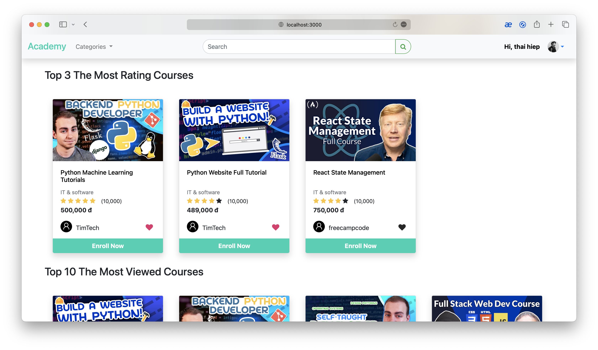
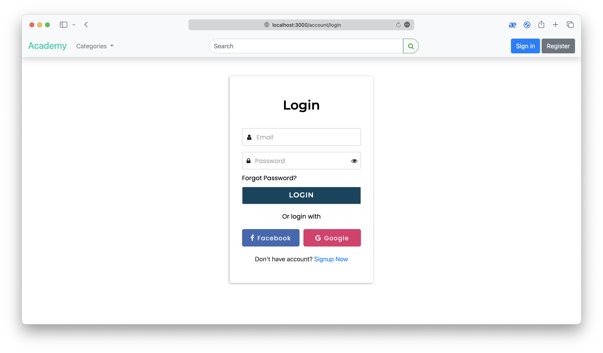
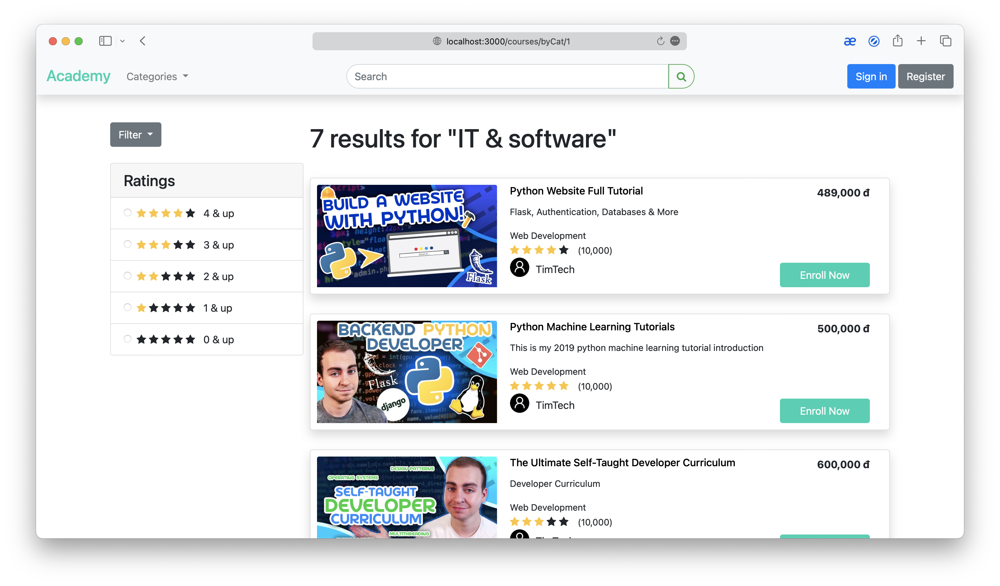
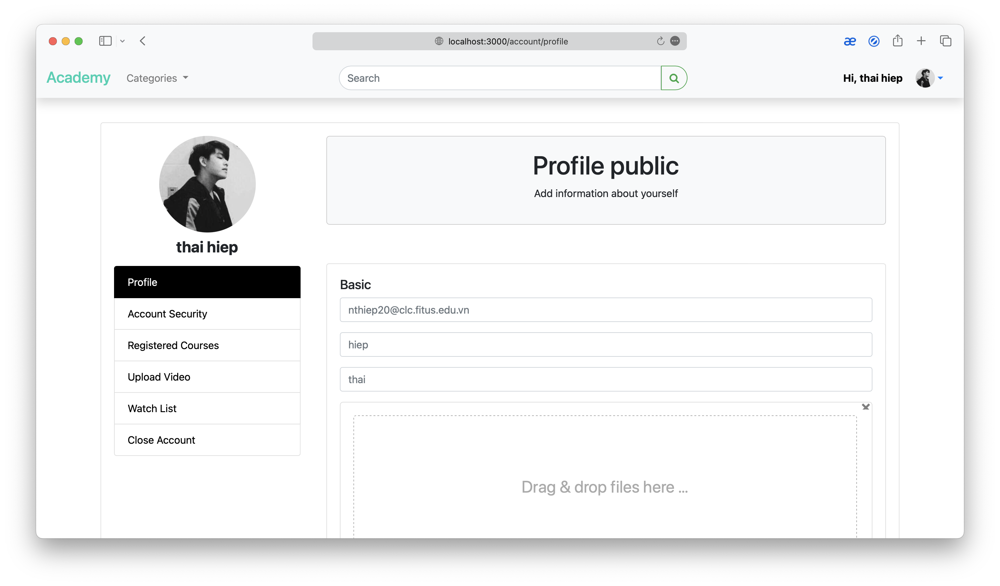

# Academy Web Application

- Made with NodeJS language
- Made with ExpressJS Framework for Back-end
- Made with HTML/JS/CSS for Front-end
- The Project of **Web Programming** Subject (Ngô Ngọc Đăng Khoa, M.Sc Instructor)
- Scores: 8.5/10
- Members of the Group 05:

    1. Nguyễn Thái Hiệp - Leader
    2. Nguyễn Thị Ngọc Hải
    3. Bùi Thị Dung
    4. Lê Anh Kiệt
    5. Đỗ Đức Duy
# Requirements

- Install [NodeJS](https://nodejs.org/en/download/)
- Install [MySQL](https://www.mysql.com/downloads/)


# Development

```
- Run `db.sql` file in folder `configs`
```

# Deployment

```
$ npm install
```
```
$ npm start
```

# Overview

- HomePage
  
- LoginPage
  
- CoursePage
  
- ProfilePage
  

Authors: Nguyễn Thái Hiệp, Nguyễn Thị Ngọc Hải, Bùi Thị Dung, Lê Anh Kiệt, Đỗ Đức Duy


